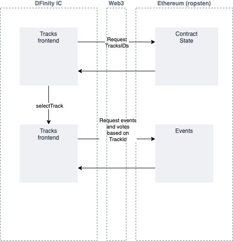

# Design Pattern Decisions 

## High-level design

### Application design

The contract stores the state required to implement tracks, small text blobs to
describe a topic, Ids for Entries, which are text descriptions and links to content
to be associated with a Track, and Idds for Votes, who voted for which Entries.

### Behaviour

Users can create Tracks, and add Entries to an existing track. They can vote
for existing entries. The application will display tracks. When users select a 
track they can see the Entries associated with that Track, ordered by the number
of votes each Track has received. 

Track and Entry creation, as well as voting, have a cooldown period, which means 
that users cannot create these or vote for multiple entries in a short space of time.
In addition, users are blocked from multiple votes on the same entry.

### Event-based storage

In order to restrict the amount of state stored on the blockchain, and reduce users
gas fees, the minimal data required is stored. Track information is stored on-chain as
its essential for this not to be lost. However, the Entries text and url data is stored purely
as events emitted, with the EntryIDs being stored on-chain only. This allows for 
entries to be added continually, with a much smaller growth in on-chain data. 
The application retrieves the TrackIDs, then can use these to search for related 
EntryCreated events on the block-chain, pulling that data diretly from those events. 
Similarly, crucial Vote data on which users have voted for which Entries and so on
is stored on-chain. But actual vote counts are generated from counting up EntryVotedFor
events on-chain for specific EntryIds. 

Although this *does* mean that this Entry and Vote data can be lost, or expire as 
state-size management is implement by Ethereum. This is not viewed as essential 
data, and indeed, means that links and viting patterns can be be kept reletively
fresh as links and votes are forgotten.

At scale, it may be better implemented through The Graph, that
will be able to give better performant application access to events through an API rather than direct
count and querying of the blockchain.

### Platforming

The application is a React app hosted as a container on the [Dfinity ICP](https://dfinity.org/) network.

## Security 

* Loop capping, [Limit looping to a max to avoid DoS through out of gas ](https://swcregistry.io/docs/SWC-128)
* Compiler compatibility, [deploy contracts with same compiler version](https://swcregistry.io/docs/SWC-103)
* Safe Math, [Solidity version > 0.8.0](https://soliditydeveloper.com/solidity-0.8) has safe maths operations by default. [math overflow mitigated by pragma requiring > 0.8.0](https://swcregistry.io/docs/SWC-101)

## Access controls and protections

* Using of Openzeppelin contracts for ownable and Pausable.
* Access Control using restriction of some functionality to owner.
* Admin contral on pausing the contract.
* User banning to block on certain functions.
* Backoff time cooloff period on creation and voting mechanism.
* Block on multiple votes.

## Future reworks

Application is PoC and should implement at least the following functionality before any production use.

### State-retention for upgrades

Currently upgrading the contract will lose all state data, and Tracks and voting
will be reset to default, losing user-contributed content. Before any production
use, should utilise the [OpenZeppelin Proxy Upgrade Pattern](https://docs.openzeppelin.com/upgrades-plugins/1.x/proxies?utm_source=zos&utm_medium=blog&utm_campaign=proxy-pattern) to enable state retention on functionality
upgrades to the contract.

### Wallet support and retricted signer use

Tracks automatically connects to the Metamask wallet, and updates the status through
the notification banner. A proper wallet connector should be used to allow for a
greater range of wallets, and 'Connect Wallet' push by the user rather than being
forced by the application, even if the user is only browsing.